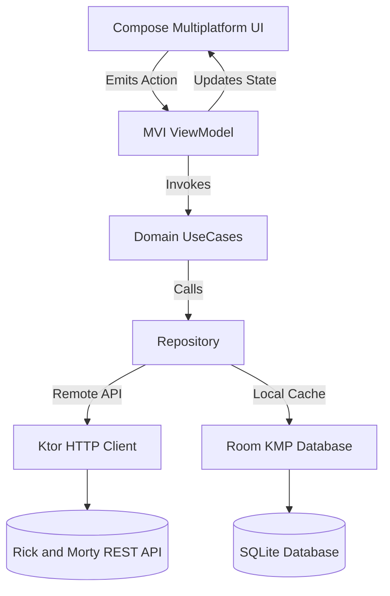

# 🧪 Rick and Morty - Kotlin Multiplatform (KMP) App

[](https://kotlinlang.org)
[](https://www.jetbrains.com/lp/compose-multiplatform/)
[](https://kotlinlang.org/docs/multiplatform/compose-navigation-3.html)
[](https://ktor.io/)
[](https://insert-koin.io/)
[](https://developer.android.com/kotlin/multiplatform/room)
[](https://coil-kt.github.io/coil/)
[](https://opensource.org/licenses/MIT)

> 🚀 **Sample Project for UZIRO KMP Sharing Session #01**  
> **Topic**: *"From Zero to Your First Kotlin Multiplatform App"*  
> **Speaker**: [Iqbal Fauzi](https://www.linkedin.com/in/ifauzii/) (Senior Mobile Engineer at Bobobox)  
> **Moderator**: [Bintang Poetra](https://www.linkedin.com/in/bintangpoetra/) (Mobile Engineer at MaxxiTani)  
> **Community**: [UZIRO KMP Community](https://bit.ly/uziro-kmp)

---

## 📖 Overview

A modern, production-grade **Kotlin Multiplatform (KMP)** and **Compose Multiplatform** application exploring the Rick and Morty multiverse. Built to demonstrate clean shared architecture, modular code separation, offline-first local caching, type-safe navigation, and rich reactive UI across **Android**, **iOS**, and **Desktop (JVM)**.

---

## 🧭 Step-by-Step Learning Guide (Branches)

Untuk memudahkan pembelajaran step-by-step dari awal inisialisasi hingga selesai, setiap tahapan telah diisolasi ke dalam branch tersendiri:

| Step | Branch | Deskripsi |
| :--- | :--- | :--- |
| **Step 1** | [`step-01-kmp-setup`](../../tree/step-01-kmp-setup) | Inisialisasi Gradle 9, Version Catalog, KMP structure |
| **Step 2** | [`step-02-core-result-error`](../../tree/step-02-core-result-error) | Core Architecture, `Result<D, E>`, `DataError` |
| **Step 3** | [`step-03-network-ktor`](../../tree/step-03-network-ktor) | Ktor 3 Client, JSON Serialization, Safe API Call |
| **Step 4** | [`step-04-database-room`](../../tree/step-04-database-room) | Room Multiplatform Database, Entities & DAOs |
| **Step 5** | [`step-05-design-system`](../../tree/step-05-design-system) | Sci-Fi Neon Theme, GlowCard, Badges, SearchBar |
| **Step 6** | [`step-06-feature-characters`](../../tree/step-06-feature-characters) | Feature Characters: List, Filter, Pagination, Detail |
| **Step 7** | [`step-07-feature-locations`](../../tree/step-07-feature-locations) | Feature Locations: Directory, Dimension, Residents |
| **Step 8** | [`step-08-feature-episodes`](../../tree/step-08-feature-episodes) | Feature Episodes: Seasons S01-S05, Cast Members |
| **Step 9** | [`step-09-feature-favorites`](../../tree/step-09-feature-favorites) | Feature Favorites Vault: Segmented Tabs & Room Flow |
| **Step 10** | [`step-10-navigation-integration`](../../tree/step-10-navigation-integration) | Navigation 3 Graph, Sci-Fi Bottom Bar, Koin Root |
| **Final** | [`main`](../../tree/main) | Final Product (All features + Android, Desktop & iOS) |

📄 Dokumentasi lengkap: [Implementation Plan](docs/implementation_plan.md) & [Progress Ledger](docs/progress.md)

---

## ✨ Features

- 🛸 **Multiverse Character Explorer**: Search, filter by status/gender/species, infinite scroll pagination, and rich detail screen with resident episodes.
- 🪐 **Dimension & Location Directory**: Browse locations across dimensions, filter by type/dimension, and view associated residents.
- 📺 **Interdimensional Episode Guide**: Comprehensive episode guide organized by seasons with air dates and featuring characters.
- 💾 **Favorites Vault (Offline Support)**: Bookmark characters and episodes stored locally in a cross-platform Room SQLite database.
- 🎨 **Rick & Morty Sci-Fi Theme**: Custom Material 3 dark cyberpunk design system with glowing portal gradients, dynamic badges, and fluid animations.
- 🛡️ **Edge-to-Edge & Adaptive Layouts**: Seamless status bar and navigation bar integration with safe window insets.

---

## 🏗️ Architecture & Tech Stack

This project follows **Clean Architecture** combined with **MVI (Model-View-Intent)** / Unidirectional Data Flow pattern.



### 🛠️ Libraries & Frameworks

| Layer / Concern | Tech / Library | Description |
| :--- | :--- | :--- |
| **Language & Tooling** | Kotlin 2.4.x, Gradle 9.x, AGP 9.2.x | Multiplatform compilation for JVM, Android, iOS |
| **UI Framework** | Compose Multiplatform 1.11.x | 100% shared declarative UI for Android, Desktop, and iOS |
| **Design System** | Material 3 + Custom Tokens | PortalGreen, CyberYellow, ElectricCyan cyberpunk theme |
| **Navigation** | Compose Multiplatform Navigation 3 | Type-safe Navigation 3 (`NavDisplay`, `entryProvider`, `NavKey`, Material 3 Adaptive) |
| **Dependency Injection**| Koin Multiplatform 4.2.x | Shared dependency injection with `koinViewModel` |
| **Networking** | Ktor Client 3.5.x | HTTP engine (OkHttp / Darwin / CIO) |
| **Serialization** | Kotlinx Serialization 1.11.x | Type-safe JSON parsing |
| **Local Database** | Room Multiplatform 2.8.x | KMP SQLite ORM with KSP code generation |
| **Image Loading** | Coil 3.5.x (Multiplatform) | High-performance image loading with Ktor network integration |
| **Concurrency** | Coroutines & StateFlow 1.11.x | Reactive state and flow pipelines |

---

## 📂 Project Structure

```text
RickAndMortyKMP/
├── .run/                               # ⚙️ Shared IDE Run Configurations (iOS & Desktop)
├── androidApp/                         # Android application entry point & Manifest
│   └── src/main/java/.../MainActivity.kt
├── composeApp/                         # 🌟 Shared Multiplatform Module
│   └── src/
│       ├── commonMain/kotlin/com/rickandmorty/app/
│       │   ├── core/
│       │   │   ├── database/           # Room Database, DAOs, and Entities
│       │   │   ├── designsystem/       # M3 Theme, Colors, Typography, & Shared Components
│       │   │   ├── network/            # Ktor Client Factory & Safe API Call wrappers
│       │   │   └── util/               # Result wrapper, Error handling, Extensions
│       │   ├── di/                     # Koin Modules (KoinHelper, AppModule, NetworkModule, DatabaseModule)
│       │   ├── navigation/             # Type-safe Navigation Graph & Bottom Navigation Bar
│       │   └── features/
│       │       ├── characters/         # Character feature (data, domain, presentation)
│       │       ├── locations/          # Location feature (data, domain, presentation)
│       │       ├── episodes/           # Episode feature (data, domain, presentation)
│       │       └── favorites/          # Favorites Vault feature
│       ├── androidMain/                # Android platform-specific implementations
│       ├── desktopMain/                # Desktop platform-specific implementations (JVM Main)
│       └── iosMain/                    # iOS platform-specific implementations (MainViewController)
├── docs/                               # 📚 Step-by-step Implementation docs
│   ├── implementation_plan.md
│   └── progress.md
├── gradle/
│   └── libs.versions.toml              # Centralized Version Catalog
└── iosApp/                             # 🍎 iOS Native Entry Point (SwiftUI & Xcode Project)
    ├── iosApp/
    │   ├── iOSApp.swift                # App entry point
    │   ├── ContentView.swift           # UIViewControllerRepresentable bridging Compose
    │   └── Info.plist                  # iOS metadata & ProMotion configuration
    └── iosApp.xcodeproj                # Xcode Project configuration
```

---

## 🚀 Getting Started

### Prerequisites

- **JDK 17 or 21** installed and configured (`JAVA_HOME`).
- **Android Studio** (Ladybug / Meerkat or later) with Kotlin Multiplatform plugin.
- **Xcode 15+** and **macOS** (for building and running the iOS target).

### Clone & Run

1. **Clone the repository:**
   ```bash
   git clone https://github.com/iqbalf/RickAndMortyKMP.git
   cd RickAndMortyKMP
   ```

2. **Run Desktop App (JVM):**
   ```bash
   ./gradlew :composeApp:run
   ```
   *Or select `desktopApp` configuration in Android Studio / IntelliJ and click **Run**.*

3. **Run Android App:**
   ```bash
   ./gradlew :androidApp:installDebug
   ```
   *Or select `androidApp` configuration in Android Studio and click **Run**.*

4. **Run iOS App:**
   - Select `iosApp` configuration in Android Studio, choose an iOS Simulator, and click **Run**.
   - *Or open `iosApp/iosApp.xcodeproj` in Xcode and press `Cmd + R`.*

---

## 🎓 Sharing Session Outline

In **UZIRO KMP Sharing Session #01**, we explore:

1. **Basic Mindset Kotlin Multiplatform**
   - Why KMP vs Flutter / React Native
   - Code-sharing spectrum: Logic only vs Full UI with Compose Multiplatform
2. **Setup Kotlin Multiplatform & Compose Environment**
   - Gradle Version Catalogs (`libs.versions.toml`)
   - Target configuration (`commonMain`, `androidMain`, `iosMain`, `desktopMain`)
3. **Build Your First Shared Architecture**
   - Clean architecture separation (Data → Domain → Presentation)
   - Ktor Client configuration & Network resilience
   - Offline caching with Room Multiplatform
   - Dependency Injection with Koin
4. **Compose Multiplatform UI**
   - Reusable design systems and themes
   - Edge-to-edge handling & WindowInsets
   - Navigation Compose with Type-Safe Routes

---

## 🤝 Community & Connect

- 💬 **Community:** [UZIRO KMP Community](https://bit.ly/uziro-kmp)
- 👨‍💻 **Speaker:** [Iqbal Fauzi](https://www.linkedin.com/in/ifauzii/) (Senior Mobile Engineer at Bobobox)
- 🎙️ **Moderator:** [Bintang Poetra](https://www.linkedin.com/in/bintangpoetra/) (Mobile Engineer at MaxxiTani)

---

## 📄 License

```text
MIT License

Copyright (c) 2026 Iqbal Fauzi
```
